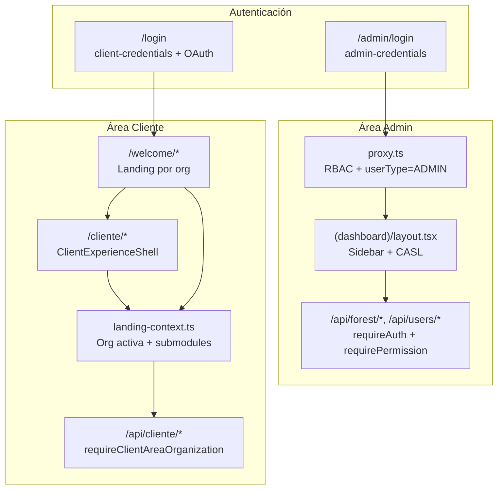
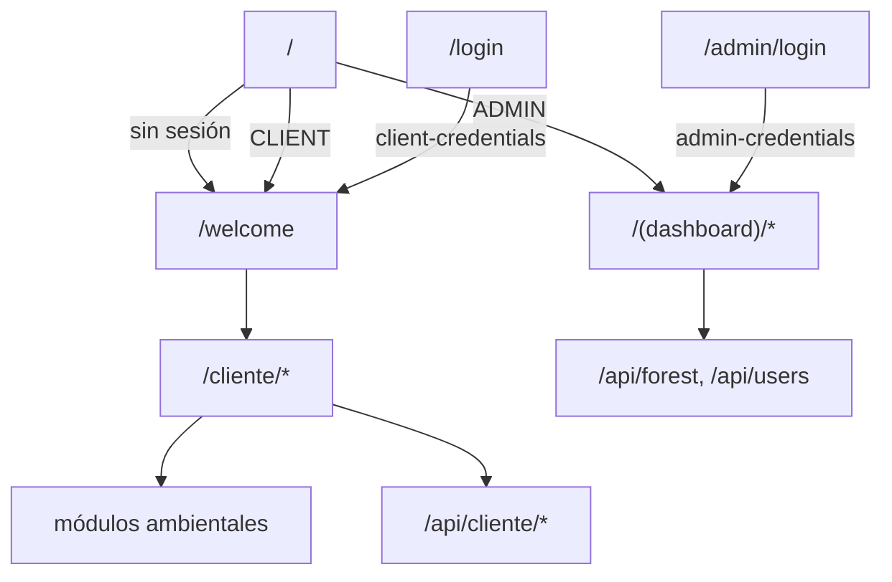

# Referencia: división Admin / Cliente (SMyEG)

Documentación detallada del patrón. Leer cuando se necesite contexto profundo para implementar o migrar.

## Diagrama de arquitectura



## Modelo de datos

### User (admin)

```prisma
model User {
  organizationId  String?
  // UserRole → Role → RolePermission → Permission → Module
}
```

Acciones RBAC: `CREATE | READ | UPDATE | DELETE | EXPORT | ADMIN`.
Roles predefinidos: `SUPER_ADMIN`, `ADMIN`, `CLIENT_MANAGER`, `GERENTE_CAMPO`, `CONTADOR`, `USER`.

### ClientUser (cliente)

```prisma
model ClientUser {
  email           String @unique
  passwordHash    String
  status          ClientUserStatus
  mobileSessions  ClientMobileSession[]
}
```

Sin `organizationId`, sin roles ni permisos en sesión JWT.

## Auth NextAuth — detalle

```typescript
// src/lib/auth.ts
export const { handlers, auth, signIn, signOut } = NextAuth({
  session: { strategy: "jwt" },
  pages: { signIn: "/admin/login" },
  providers: [
    Credentials({
      id: "admin-credentials",
      credentials: {
        identifier: { type: "text" },
        password: { type: "password" },
        organizationId: { type: "text" }, // obligatorio para admin
      },
      // authorize → prisma.user + getUserRolesAndPermissions
    }),
    Credentials({
      id: "client-credentials",
      // authorize → prisma.clientUser
    }),
    // Google/GitHub/Facebook → solo ClientUser
  ],
});
```

Sesión JWT incluye:
- `userType`: `"ADMIN"` | `"CLIENT"` | `"SERVICE"`
- Admin: `roles[]`, `permissions[]`, `organizationId`, `organizationName`
- Cliente: `roles: []`, `permissions: []`

## Proxy — guard de red

```typescript
// src/proxy.ts
const adminProtectedRoutes = [
  "/admin/geovisor", "/dashboard", "/roles", "/users",
  "/usuarios-clientes", "/organizaciones", "/patrimonio-forestal",
  "/activos-mediciones", "/configuracion-forestal", "/settings", "/audit",
];

const clientProtectedRoutes: string[] = [];

const routeModuleMap = [
  { prefix: "/dashboard", module: "dashboard" },
  { prefix: "/users", module: "users" },
  { prefix: "/usuarios-clientes", module: "client-users" },
  { prefix: "/patrimonio-forestal", module: "forest-patrimony" },
  // ...
];
```

Flujo:
1. `/admin` → redirect login o dashboard
2. Ruta admin sin token ADMIN → `/admin/login?next=…`
3. RBAC por módulo → `/unauthorized` si no hay permiso `read`
4. Restricción org "Por defecto" para rutas forestales (no SUPER_ADMIN)
5. Usuario logueado en login pages → redirect según `userType`

## Layout admin

```typescript
// src/app/(dashboard)/layout.tsx
const nav = [
  { href: "/dashboard", label: "Geovisor", module: "dashboard" },
  { href: "/organizaciones", label: "Organizaciones", module: "organizations", onlyAdmin: true },
  { href: "/users", label: "Usuarios", module: "users", adminOrGerente: true },
  { href: "/usuarios-clientes", label: "Usuarios cliente", module: "client-users", adminOrGerente: true },
  // ...
];

if (!session?.user?.id && !rolUsuario) {
  redirect("/admin/login");
}

const ability = buildAbilityFromPermissions(permissions);
// nav filtrada: ability.can("read", item.module)
```

Cookies auxiliares post-login admin: `RolUsuario`, `OrgName`, `EmailUsuario`.

## Shell cliente

```tsx
// src/components/client/ClientExperienceShell.tsx
<Theme accentColor="jade" grayColor="sand" appearance="inherit">
  <div className="client-atmosphere min-h-screen text-foreground">
    <ClientNavbar />
    <main className="mx-auto max-w-7xl px-4">{children}</main>
  </div>
</Theme>
```

Clases CSS cliente: `client-atmosphere`, `client-orb`, `client-grid`, `client-panel`.
Dark mode: `dark:border-white/10`, toggle en `ClientUserMenu`.

## Landing context

```typescript
// src/lib/landing-context.ts
export async function resolveActiveLandingOrganization(preferredId?) {
  // 1. preferredId (query param)
  // 2. activeLandingOrganizationId (config global)
  // 3. org por defecto por nombre
  // 4. primera org activa
}

export async function resolveLandingContext(preferredId?) {
  const organization = await resolveActiveLandingOrganization(preferredId);
  return {
    organization,
    templateHref,
    submodules: normalizeSubmodules(config.clientSubmodulesValue).filter(i => i.isActive),
    appTitle,
  };
}
```

## Guard API cliente

```typescript
// src/lib/cliente/require-client-area-organization.ts
export async function requireClientAreaOrganization(moduleLabel, req?) {
  const orgIdFromQuery = req ? new URL(req.url).searchParams.get("organizationId") : null;
  const landingContext = await resolveLandingContext(orgIdFromQuery);

  if (!landingContext?.organization.id) {
    return { error: fail(`No hay organización activa para ${moduleLabel}`, 404) };
  }

  return { landingContext };
}
```

## API helpers admin

```typescript
// src/lib/api-helpers.ts
export async function requireAuth() {
  // 1. Sesión JWT NextAuth
  // 2. Bearer token SINIIF (SERVICE)
  // 3. Sesión móvil cliente (client_mobile_sessions)
  // 4. Fallback cookie EmailUsuario (legacy)
}

export async function requirePermission(permissions, moduleSlug, action) {
  if (!hasPermission(permissions, moduleSlug, action)) {
    return { error: fail("Forbidden", 403) };
  }
}
```

## Nav cliente dinámica

```typescript
// src/components/client/ClientNavbar.tsx
const navLinks = useMemo(() => {
  const dynamicLinks = (landingContext?.submodules ?? [])
    .filter(item => item.isActive)
    .sort((a, b) => a.order - b.order)
    .map(item => ({ href: item.href, label: item.label }));

  return landingContext
    ? [{ href: "/welcome", label: "Inicio" }, ...dynamicLinks]
    : [{ href: "/welcome", label: "Inicio" }];
}, [landingContext]);
```

Submodules configurables desde admin en `settings/system`:

```typescript
const KNOWN_CLIENT_SUBMODULE_ROUTES = [
  { label: "Tarifas", href: "/cliente/tarifas" },
  { label: "Hidrológico", href: "/cliente/hidrologico" },
  { label: "Biodiversidad", href: "/cliente/biodiversidad" },
  { label: "Alertas", href: "/cliente/alertas-amenazas" },
  { label: "Colector", href: "/cliente/colector-datos" },
  { label: "Geovisor", href: "/cliente/geovisor" },
];
```

## State management

| Store | Ubicación | Área | Persistencia |
|---|---|---|---|
| `authStore` | `src/stores/` | Admin | No |
| `uiStore` | `src/stores/` | Admin (sidebar, tema) | localStorage |
| `dashboardStore` | `src/stores/` | Admin (widgets) | No |
| `useGeovisorStore` | `src/store/` | Admin + Cliente | — |
| `geovisor-client-*.ts` | `src/lib/` | Cliente | localStorage |

Cliente no usa Zustand global salvo casos puntuales. Prefiere React state + fetch + localStorage.

## Geovisor duplicado

```
admin/geovisor/     → import geo, jobs N1-N3, capas operativas
cliente/geovisor/   → MapView, ScriptRunner GEE, sidebar stats
store/useGeovisorStore → tipos compartidos, estado parcial
```

Admin opera; cliente explora. No forzar un solo componente.

## Multi-tenancy

| Área | Resolución de org |
|---|---|
| Admin | `session.user.organizationId`. SUPER_ADMIN ve todas. |
| Cliente | Landing context (config + query param). No de sesión ClientUser. |
| API admin | `session.user.organizationId` + checks SUPER_ADMIN |
| API cliente | `landingContext.organization.id` |

## Naming conventions

| Patrón | Ejemplo | Significado |
|---|---|---|
| Route group | `(dashboard)/users` → `/users` | Backoffice sin prefijo |
| Prefijo admin | `/admin/login` | Entry admin |
| Prefijo cliente | `/cliente/biodiversidad` | UI cliente (español URL) |
| Components | `components/client/ClientNavbar` | UI cliente (inglés carpeta) |
| Lib helpers | `lib/cliente/require-*` | Helpers área cliente |
| Lib adapters | `lib/client/hidromet-charts` | Datos/adaptadores cliente |
| API español | `/api/cliente/alertas` | Lectura pública scoped |
| API inglés | `/api/client/tariffs` | Auth cliente |
| Repos | `client-alerts-repository` | Queries scoped org landing |
| Repos | `admin-geo-repository` | Operaciones admin |
| Validations | `client-alerts.schema.ts` | Zod schemas cliente |
| CSS | `client-panel`, `client-atmosphere` | Design system cliente |

## Flujo de acceso



## Observaciones arquitectónicas

1. "Admin" ≠ solo `/admin`: el backoffice principal está en `(dashboard)/` con URLs planas.
2. Cliente mayormente público: lectura ambiental no exige login; auth solo para POST sensibles o tarifas persistentes.
3. Dos tablas de usuario sin relación directa: `User` (RBAC) vs `ClientUser` (sin roles).
4. Org cliente viene de landing, no de sesión ClientUser.
5. Next.js 16: guards en `src/proxy.ts`.
6. Admin configura submodules cliente; cliente solo consume lo activo.

## Prompts sugeridos

**Nueva feature admin:**
> Implementa en `(dashboard)/` con módulo RBAC `{slug}`, protege ruta en `proxy.ts`, usa `requirePermission()` en API, filtra nav en layout.

**Nueva feature cliente:**
> Implementa en `cliente/{modulo}/`, API en `/api/cliente/{modulo}/` con `requireClientAreaOrganization()`, registra en submodules, dark mode.

**Feature dual:**
> Separa `admin/` vs `cliente/`, comparte lógica en `src/lib/` solamente.

**Migración:**
> Extraer ClientUser → route groups → proxy guards → shells → APIs por prefijo.
