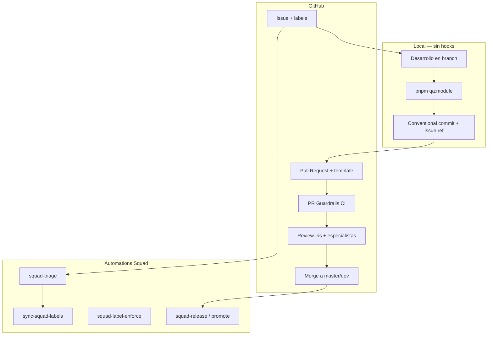

# Referencia: Git Workflow (SMyEG / Squad)

Documentación detallada para implementar o migrar flujos Git en proyectos similares.

## Arquitectura de capas



## Modelos de branching

### Modelo operativo SMyEG (actual)

```
master (default)
├── feat/landing-cliente-repositorio
├── squad/{n}-{slug}
└── repo
```

- Rama default: `master` (`origin/HEAD -> origin/master`)
- Feature branches desde `master`
- Merge target: `master`
- README referencia `git push origin master` para docs Mintlify

### Modelo Squad (prescriptivo / plantilla)

```
dev ──→ preview ──→ main (tagged releases)
  └──→ insider (early access)
```

| Rama | Propósito |
|---|---|
| `dev` | Integración — todo el trabajo feature |
| `preview` | Pre-release (sin `.squad/` / `.ai-team/`) |
| `main` | Release estable, tagged |
| `insider` | Early-access sincronizado desde dev |

**Promoción** (`squad-promote.yml`, manual dispatch):
- `dev → preview`: merge con stripping de `.squad/`, `.ai-team/`
- `preview → main`: valida CHANGELOG + ausencia de archivos forbidden

**Hotfixes:** `hotfix/{slug}` desde `main`, PR a `dev`, cherry-pick a `main` si urgente.

**Gap conocido:** plantillas Squad asumen `dev/preview/main`; muchos clones operan solo con `master`.

## Issue → Branch → PR → Merge

### 1. Crear issue

Plantillas en `.github/ISSUE_TEMPLATE/`:

| Template | Prefix | Labels default |
|---|---|---|
| `01-crud-feature.md` | `[CRUD]` | `squad`, `area:crud` |
| `02-geospatial-change.md` | `[GEO]` | `squad`, `area:geo`, `needs:data-platform-check` |
| `03-dependency-update.md` | `[DEPS]` | `squad`, `area:deps`, `needs:compatibility-check` |
| `04-security-permissions-incident.md` | `[SECURITY]` | `squad`, `area:security`, `needs:permissions-check` |
| `05-client-tarifas-regression.md` | `[CLIENTE-TARIFAS]` | `squad`, `area:cliente`, `needs:mintlify-update` |

`config.yml`: `blank_issues_enabled: false`.

### 2. Triage y asignación

```text
Label squad → squad-triage.yml → Helena auto-triage → squad:{member}
Label squad:{member} → squad-issue-assign.yml → comentario + copilot assign
```

Labels sincronizados desde `.squad/team.md` vía `sync-squad-labels.yml`.

### 3. Branch

```bash
# SMyEG (master)
git checkout master && git pull origin master
git checkout -b squad/42-add-profile-api

# Squad (dev)
git checkout dev && git pull origin dev
git checkout -b squad/42-add-profile-api
```

### 4. Commits

```
{type}({scope}): {descripcion} (#{issue-number})

{explicacion detallada si necesaria}

Closes #{issue-number}

Co-authored-by: Copilot <223556219+Copilot@users.noreply.github.com>
```

Tipos: `feat`, `fix`, `docs`, `refactor`, `test`, `chore`, `perf`, `style`, `build`, `ci`

Ejemplos reales:
```
fix: corrige stamp bug (#195)
docs: actualiza portal Mintlify
chore: promote dev → preview (v0.1.0)
```

**Sin enforcement:** no hay commitlint, husky, ni lint-staged.

### 5. Push y PR

```bash
git push -u origin squad/42-add-profile-api
gh pr create --base master --title "feat: add profile API" --body-file pr-body.md
gh pr ready   # sacar de Draft
```

Body mínimo para pasar Guardrails:
```markdown
## Summary
- Issue relacionado: #42

## Evidence
### Technical validation (mandatory)
- [x] pnpm lint
- [x] pnpm exec tsc --noEmit
- [x] pnpm test:all
- [x] pnpm build
```

### 6. Review y merge

- PR Guardrails en verde
- Sin labels `needs:*`
- Iris + especialista por área (Vera, Dario, Maia, Otto, Gaia)
- Merge squash o merge commit según política del repo

## PR Guardrails — detalle

Archivo: `.github/workflows/pr-guardrails.yml`

Triggers: `opened`, `edited`, `synchronize`, `reopened`, `ready_for_review`, `labeled`, `unlabeled`

Validaciones (via `actions/github-script@v7`):

```javascript
// 1. No draft
if (pr.draft) fail();

// 2. No needs:* labels
const blockingNeeds = labels.filter(n => n.startsWith('needs:'));
if (blockingNeeds.length) fail();

// 3. Issue reference
const hasIssueRef =
  /Issue relacionado:\s*(?:#\d+|https?:\/\/)/i.test(body) ||
  /\b(?:close[sd]?|fix(?:e[sd])?|resolve[sd]?)\s+#\d+\b/i.test(body) ||
  /\B#\d+\b/.test(body);

// 4. Checkboxes marcados
const requiredChecks = [
  'pnpm lint',
  'pnpm exec tsc --noEmit',
  'pnpm test:all',
  'pnpm build'
];
// pattern: - [x] {check}
```

**Limitación:** valida metadatos del PR, no ejecuta lint/tests/build en CI.

## Gate de calidad local

```bash
pnpm qa:module
# = pnpm lint && pnpm exec tsc --noEmit && pnpm test:all && pnpm build
```

Scripts relacionados (lifecycle npm, no git hooks):
- `predev` / `prebuild` → `pnpm guard:admin-geo-routes`
- `build:clean` → limpia `.next` corrupto

No hay scripts `git add/commit/push` en `package.json`.

## Hooks Git — estado

| Herramienta | Estado |
|---|---|
| `.husky/` | No existe |
| `husky` | No en package.json |
| `lint-staged` | No |
| `commitlint` | No |
| `prepare` script | No |

Alternativa para agentes Scribe: validación manual de secretos antes de commit (skill `secret-handling`), no hook automatizado.

## Worktrees multi-agente

### Cuándo usar

| Escenario | Estrategia |
|---|---|
| 1 issue | checkout normal |
| 2+ issues simultáneos | worktree por issue |
| Multi-repo | clones hermanos |

### Setup

```bash
git fetch origin master   # o dev
git worktree add ../smyeg-195 -b squad/195-fix-stamp-bug origin/master
git worktree add ../smyeg-193 -b squad/193-refactor-loader origin/master
```

### Reglas

- Cada worktree: branch propia, PR independiente
- `.squad/` en cada worktree: **append only**
- `.gitattributes` con `merge=union` reconcilia merges concurrentes

### Cleanup

```bash
git worktree remove ../smyeg-195
git branch -d squad/195-fix-stamp-bug
git push origin --delete squad/195-fix-stamp-bug
git worktree prune
```

## .gitattributes

```
.squad/decisions.md merge=union
.squad/agents/*/history.md merge=union
.squad/log/** merge=union
.squad/orchestration-log/** merge=union
```

Permite merge concurrente de archivos append-only entre worktrees/ramas.

## .gitignore — inventario

| Categoría | Patrones |
|---|---|
| Dependencias | `/node_modules`, `.pnp.*`, `.yarn/*` |
| Build Next.js | `/.next/`, `/out/`, `/build` |
| Env/secrets | `.env*` |
| TypeScript | `*.tsbuildinfo`, `next-env.d.ts` |
| Prisma generado | `/src/generated/prisma` |
| Uploads | `/public/uploads` |
| Mobile | `*.apk` |
| Docs internos | `/docs`, `/internal-docs` |
| Scripts | `/scripts` (whitelist: 4 archivos) |
| OpenSpec | `/openspec`, `.openspec` |
| Squad runtime | `.squad/orchestration-log/`, `.squad/log/`, `.squad/decisions/inbox/`, `.squad/sessions/`, `.squad-workstream` |

Promoción preview/main: workflows eliminan `.squad/` del árbol publicado.

## Labels — namespaces completos

Sincronizados desde `.squad/team.md`:

| Namespace | Valores |
|---|---|
| `squad` | inbox triage |
| `squad:{member}` | helena, bruno, vera, gaia, iris, dario, maia, otto, nico, alma, livia, teo, nadia, scribe |
| `squad:copilot` | coding agent |
| `go:` | yes, no, needs-research |
| `release:` | v0.4.0, v0.5.0, backlog |
| `type:` | feature, bug, spike, docs, chore, epic |
| `priority:` | p0, p1, p2 |
| `area:` | crud, geo, deps, security, cliente, docs |
| `needs:` | permissions-check, data-platform-check, compatibility-check, mintlify-update |
| Señales | `bug`, `feedback` |

Exclusividad enforced por `squad-label-enforce.yml`.

## Ownership matrix (extracto)

| Repo Area | DRI | Reviewer Gate |
|---|---|---|
| `src/app/api/**` | Bruno | Iris |
| `prisma/**` | Dario | Iris |
| `src/workers/**` | Gaia | Iris |
| `src/app/cliente/**` | Livia | Iris |
| `mintlify-docs/**` | Maia | Iris |
| `package.json` + lockfile | Otto | Iris |
| Seguridad multiorg | Vera | Iris |

## Workflows GitHub Actions

| Workflow | Trigger | Función |
|---|---|---|
| `pr-guardrails.yml` | PR events | Metadatos PR |
| `squad-ci.yml` | PR a dev/preview/main/insider; push dev/insider | `node --test test/*.test.js` |
| `sync-squad-labels.yml` | Push `.squad/team.md`; manual | Sync labels |
| `squad-triage.yml` | Issue labeled `squad` | Auto-triage Helena |
| `squad-label-enforce.yml` | Issue labeled | Exclusividad labels |
| `squad-issue-assign.yml` | Issue labeled `squad:*` | Asignación + Copilot |
| `squad-heartbeat.yml` | Cron L 8:30; events | Auto-triage backlog |
| `squad-promote.yml` | Manual | dev→preview→main |
| `squad-release.yml` | Push main | Tag + Release desde package.json |
| `squad-preview.yml` | Push preview | Valida CHANGELOG, no `.squad/` |
| `squad-insider-release.yml` | Push insider | Tag prerelease |
| `squad-docs.yml` | Push preview (docs/**) | GitHub Pages |

**Gap:** `squad-ci.yml` no ejecuta `pnpm qa:module`; gate real = autor + checklist + review.

## Reviewer protocol

Skill: `.squad/templates/skills/reviewer-protocol/SKILL.md`

- Autor original **no puede** auto-revisar tras rechazo
- Debe intervenir otro agente
- Deadlock → escalar al usuario

## Windows — reglas de commit

De `.squad/templates/skills/windows-compatibility/SKILL.md`:

- No usar `git -C {path}` en Windows
- No usar `\n` en `git commit -m` (PowerShell falla silenciosamente)
- Usar archivo temporal + `git commit -F $msgFile`

```powershell
$msg = @"
feat(api): agrega endpoint de perfil (#42)

Closes #42
"@
$msg | Out-File -Encoding utf8 .git/COMMIT_MSG
git commit -F .git/COMMIT_MSG
Remove-Item .git/COMMIT_MSG
```

## Lo que NO existe en SMyEG

- Bugbot / integración Cursor Bugbot en repo
- CODEOWNERS
- Dependabot config
- Husky / lint-staged / commitlint
- Hooks pre-commit automatizados
- CI que ejecute el gate completo `pnpm qa:module`

## Plantilla mínima para otro proyecto

### `.github/PULL_REQUEST_TEMPLATE.md`

```markdown
## Summary
- Issue relacionado: #<numero>

## Technical validation
- [ ] pnpm lint
- [ ] pnpm exec tsc --noEmit
- [ ] pnpm test:all
- [ ] pnpm build
```

### `.github/workflows/pr-guardrails.yml`

Copiar de SMyEG y adaptar `requiredChecks` al stack del proyecto.

### `AGENTS.md` (sección Git)

```markdown
## Git
- Gate pre-PR: `pnpm qa:module`
- Commits en español, conventional commits con `(#issue)`
- PRs: template completo, no Draft, PR Guardrails verde
- Limpiar labels `needs:*` antes de merge
```

### `.gitattributes` (si hay estado compartido multi-agente)

```
.team/decisions.md merge=union
.team/log/** merge=union
```

## Prompts sugeridos para agentes

**Nuevo feature:**
> Crea issue con plantilla, branch `squad/{n}-{slug}` desde master, implementa, `pnpm qa:module`, PR con template y checkboxes marcados, referencia `#n`.

**Fix urgente:**
> Branch `hotfix/{slug}` desde master, fix mínimo, PR sin Draft, Guardrails verde, review Iris.

**Multi-issue paralelo:**
> Worktree por issue, append-only en archivos de estado, PRs independientes, cleanup post-merge.

**Migrar repo sin flujo:**
> Añadir PR template + pr-guardrails.yml + documentar gate local + convención commits + verificar rama default.

**Commit en Windows:**
> Usar `git commit -F` con archivo UTF-8, nunca `-m` multilínea en PowerShell.

## Mapa de archivos SMyEG

```
.github/PULL_REQUEST_TEMPLATE.md
.github/workflows/pr-guardrails.yml
.github/workflows/squad-*.yml
.github/ISSUE_TEMPLATE/
.squad/routing.md
.squad/team.md
.squad/templates/skills/git-workflow/SKILL.md
.squad/templates/issue-lifecycle.md
.squad/operations/helena-ralph-runbook.md
.gitattributes
.gitignore
AGENTS.md
README.md
package.json (qa:module)
```
