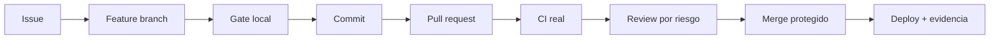

# Referencia eVoting: Git, PR y CI

Consulta esta referencia al configurar GitHub, crear plantillas, definir gates o coordinar trabajo paralelo.

## Flujo recomendado



## Triage por riesgo

| Riesgo | Ejemplos | Requisitos |
|---|---|---|
| Bajo | Copy, docs, estilos sin lógica | Lint/build afectado + QA proporcional |
| Medio | CRUD de planchas, import padrón, mapa admin | Unit/integration + ownership + tenant |
| Alto | Auth/MFA, emisión, urna, tally, claves, migración | Threat review, pruebas de concurrencia, revisores especializados |

Etiquetas sugeridas:

```text
type:feature | type:bug | type:security | type:migration | type:docs
area:auth | area:voting | area:ballot | area:tally | area:geo | area:data | area:frontend
priority:p0 | priority:p1 | priority:p2
needs:security-review | needs:data-review | needs:geo-review | needs:docs
```

No usar una label `needs:*` como sustituto de asignar al revisor; debe bloquear merge hasta resolverse.

## Plantilla de issue

```markdown
## Objetivo

## Contexto electoral
- Organización/tenant:
- Estado de elección afectado:
- Roles afectados:

## Criterios de aceptación
- [ ] ...

## Riesgos
- [ ] Identidad/PII
- [ ] Secreto del voto
- [ ] Doble voto/concurrencia
- [ ] Migración/PostGIS
- [ ] Publicación territorial

## Validación esperada
- pytest:
- Playwright:
- Evidencia manual:
```

## Plantilla de pull request

```markdown
## Resumen
- Closes #<issue>
- Tipo de cambio:
- Riesgo:

## Decisiones
- ...

## Validación backend
- [ ] `python -m ruff check apps/backend`
- [ ] `python -m black --check apps/backend`
- [ ] `python -m mypy apps/backend/app`
- [ ] `python -m pytest apps/backend/tests`

## Validación frontend
- [ ] `pnpm --dir apps/frontend lint`
- [ ] `pnpm --dir apps/frontend exec tsc --noEmit`
- [ ] `pnpm --dir apps/frontend build`
- [ ] Playwright si aplica

## Seguridad electoral
- [ ] Aislamiento por organización
- [ ] Permisos/ownership/estado electoral
- [ ] Sin PII o correladores en urna/logs
- [ ] Sin resultados prematuros

## Datos y despliegue
- [ ] Migración Alembic revisada
- [ ] Estrategia de rollback o roll-forward
- [ ] Compatibilidad app/schema evaluada

## Evidencia
- Logs resumidos, capturas o reportes sin secretos/PII.
```

## Workflows GitHub Actions

Estructura sugerida:

```text
.github/workflows/
├── backend-ci.yml
├── frontend-ci.yml
├── e2e.yml
├── migrations-ci.yml
├── security-ci.yml
└── pr-guardrails.yml
```

### Backend CI

```yaml
name: Backend CI
on:
  pull_request:
    paths:
      - "apps/backend/**"
      - "pyproject.toml"
      - "requirements*.txt"

permissions:
  contents: read

jobs:
  quality:
    runs-on: ubuntu-latest
    services:
      postgres:
        image: postgis/postgis:15-3.4
        env:
          POSTGRES_DB: evoting_test
          POSTGRES_USER: postgres
          POSTGRES_PASSWORD: postgres
        ports: ["5432:5432"]
        options: >-
          --health-cmd "pg_isready -U postgres"
          --health-interval 10s
          --health-timeout 5s
          --health-retries 5
    steps:
      - uses: actions/checkout@v4
      - uses: actions/setup-python@v5
        with:
          python-version: "3.12"
          cache: pip
      - run: python -m pip install -r apps/backend/requirements.txt
      - run: python -m ruff check apps/backend
      - run: python -m black --check apps/backend
      - run: python -m mypy apps/backend/app
      - run: python -m pytest apps/backend/tests
```

Pinear versiones exactas de dependencias del proyecto. El snippet es estructural, no reemplaza el lock/resolver elegido.

### Frontend CI

```yaml
name: Frontend CI
on:
  pull_request:
    paths:
      - "apps/frontend/**"
      - "pnpm-lock.yaml"

permissions:
  contents: read

jobs:
  quality:
    runs-on: ubuntu-latest
    steps:
      - uses: actions/checkout@v4
      - uses: pnpm/action-setup@v4
      - uses: actions/setup-node@v4
        with:
          node-version-file: ".nvmrc"
          cache: pnpm
      - run: pnpm install --frozen-lockfile
      - run: pnpm --dir apps/frontend lint
      - run: pnpm --dir apps/frontend exec tsc --noEmit
      - run: pnpm --dir apps/frontend build
```

### E2E

- Instalar navegadores con `playwright install --with-deps`.
- Usar usuarios y elecciones sintéticos.
- No grabar traces/videos que contengan secretos; sanitizar artefactos.
- Ejecutar flujos MFA con proveedor simulado o inbox de test.
- Probar doble clic, refresh, sesión expirada y receipt verification.

### Migraciones CI

1. Levantar PostgreSQL/PostGIS vacío.
2. `alembic upgrade head`.
3. Cargar fixtures mínimos.
4. Verificar `alembic check`.
5. Opcional: probar upgrade desde la última versión publicada con snapshot sintético.
6. Nunca ejecutar migraciones de PR contra staging/producción.

## Branch protection

Configurar en `main`:
- pull request obligatorio;
- checks requeridos reales;
- conversación resuelta;
- al menos un revisor, más gates por CODEOWNERS o proceso;
- impedir force push y deletion;
- administradores sujetos a la política cuando sea viable;
- firmas o verified commits si la organización lo exige.

## CODEOWNERS sugerido

```text
/apps/backend/app/auth/              @security-team
/apps/backend/app/domain/ballot/     @security-team @backend-team
/apps/backend/app/domain/tally/      @security-team @backend-team
/apps/backend/alembic/               @data-team
/apps/backend/app/geo/               @geo-team @security-team
/apps/frontend/src/app/(voter)/      @frontend-team @security-team
/.github/workflows/                  @release-team @security-team
```

Adaptar a usuarios/equipos reales; no copiar aliases inexistentes.

## Manejo de secretos

Prohibido versionar:
- claves privadas de elección;
- shares de custodios;
- secretos JWT/MFA;
- credenciales de base de datos;
- padrones o exports;
- tokens Mapbox privados;
- dumps con datos reales.

Antes de commit:

```powershell
git diff --cached --name-only
git diff --cached
```

Configurar secret scanning y push protection en GitHub. Los fixtures usan dominios reservados y documentos ficticios.

## Estrategia de commits

Commits pequeños y coherentes:

```text
feat(auth): agrega contrato MFA del elector (#42)
test(auth): cubre expiración y replay de OTP (#42)
docs(auth): documenta cookies y CSRF (#42)
```

No dividir artificialmente si deja el árbol roto. Cada commit debería ser revisable y, cuando sea posible, pasar tests relevantes.

## Worktrees multiagente

Reglas:
- un issue y branch por worktree;
- no editar el mismo archivo desde dos worktrees sin coordinación;
- registrar contratos compartidos antes del fan-out;
- no compartir puertos ni bases de datos de test;
- cada worktree conserva su propia evidencia.

Ejemplo Windows:

```powershell
git fetch origin
git worktree add "..\evoting-101" -b feat/101-election-crud origin/main
git worktree add "..\evoting-102" -b test/102-election-api origin/main
```

## Releases y migraciones

Orden típico compatible:
1. Backup verificado cuando el riesgo lo requiere.
2. Migración expand compatible con versión actual.
3. Deploy de aplicación nueva.
4. Backfill controlado/observable.
5. Activación de feature flag.
6. Migración contract en release posterior.

No ejecutar downgrade destructivo como rollback automático. Preferir roll-forward.

## Incidentes críticos

Para `hotfix/*`:
- alcance mínimo;
- issue de incidente o referencia equivalente;
- no saltar pruebas críticas;
- review de seguridad si afecta auth/urna/tally;
- plan de despliegue y reversión;
- retrospectiva posterior.

## Checklist de CI seguro

```text
- [ ] permissions mínimos
- [ ] actions confiables y versionadas
- [ ] dependencias con lock/frozen install
- [ ] sin secrets en PRs de forks
- [ ] artefactos sanitizados
- [ ] PostgreSQL/PostGIS efímero
- [ ] pytest y Playwright con datos sintéticos
- [ ] migration upgrade verificado
- [ ] checks requeridos en branch protection
- [ ] secret scanning habilitado
```
