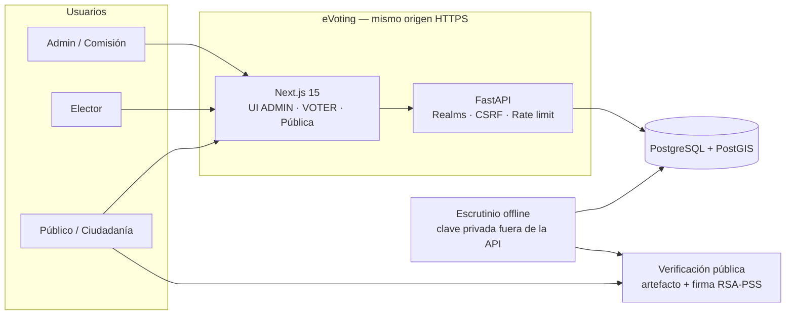
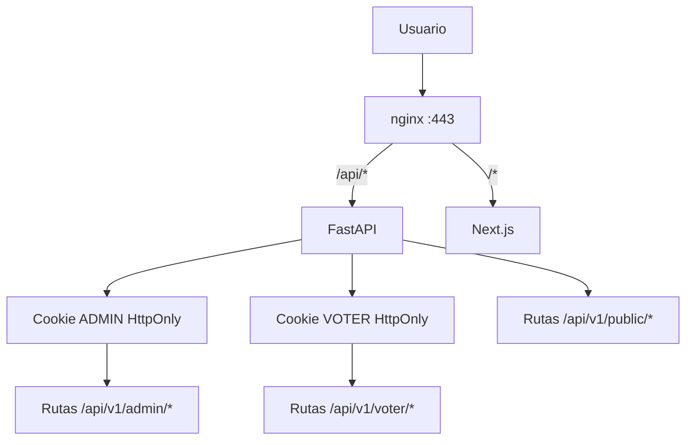
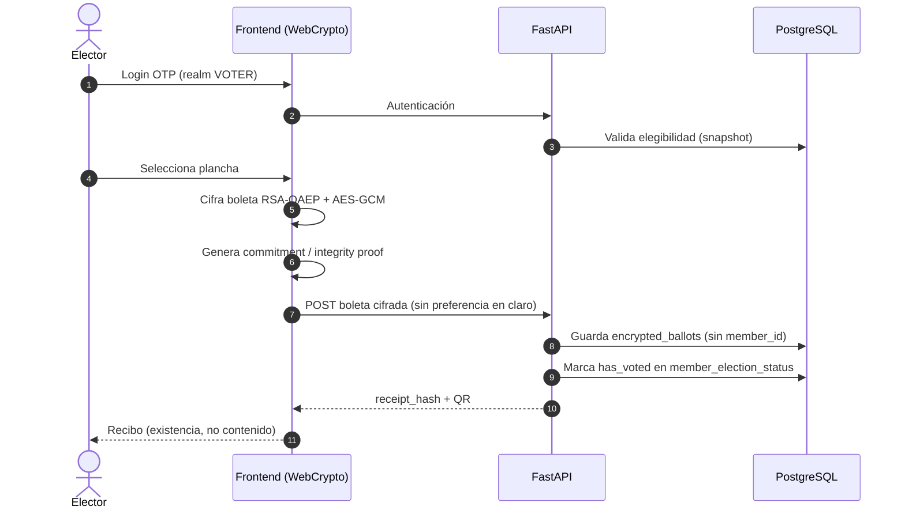
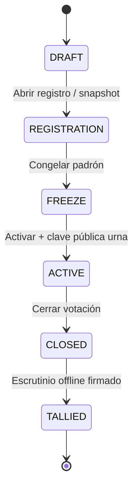
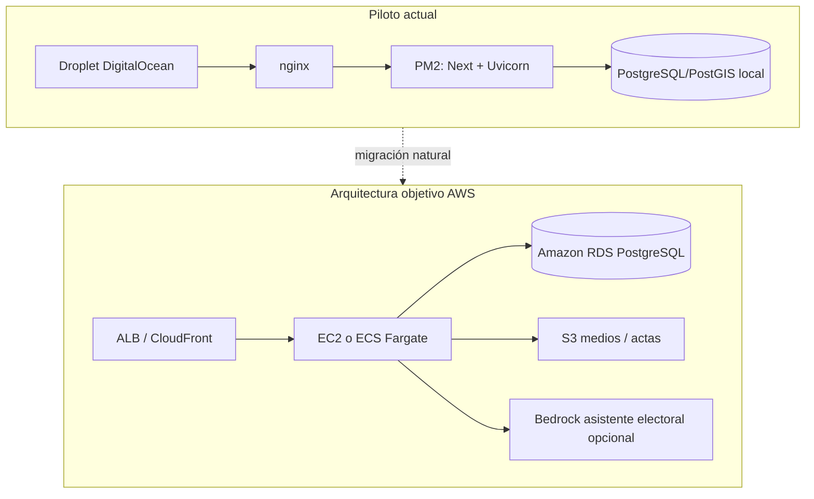

# Arquitectura eVoting (para jurado)

## 1. Vista de contexto

## 2. Separación de realms (seguridad)

**Idea clave:** cookies por realm, `SameSite=strict`, sin mezclar privilegios ADMIN y VOTER.

## 3. Flujo de voto (impacto + innovación)

## 4. Ciclo electoral

## 5. Mapa de despliegue actual → AWS

## 6. Componentes principales (para el vídeo)

| Componente | Qué demuestra |
|------------|---------------|
| Portal público `/elections` | Transparencia sin padrón |
| Área cliente `/cliente` | UX ciudadana + geovisor |
| Voto `/vote` | Cifrado en cliente + recibo |
| Admin `/admin` | Ciclo electoral y padrón |
| Verify `/verify/...` | Auditabilidad independiente |
| Recibo `/recibo/...` | Existencia sin filtrar preferencia |

## 7. Principios de seguridad (slide único)

1. Clave privada de urna **nunca** en API, DB, frontend ni logs  
2. Urna sin `member_id`  
3. Escrutinio offline + firma del acta  
4. MFA / OTP, CSRF, rate limiting, cookies Secure en producción  
5. Resultados de piloto no se publican como oficiales  
