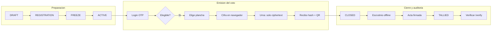
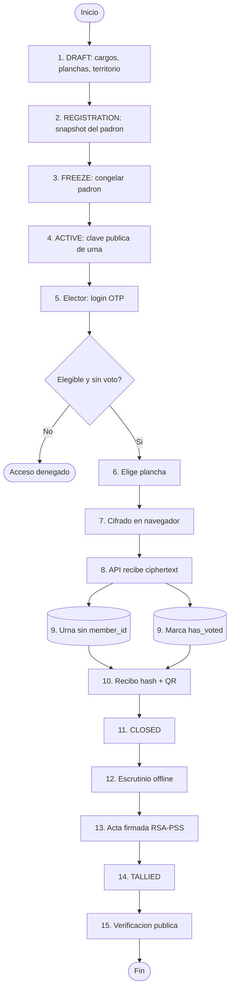

# Diagrama del proceso electoral — eVoting

Usa este Mermaid (más legible que FigJam para narrar). Ábrelo en [mermaid.live](https://mermaid.live), exporta PNG y muéstralo en Snagit.

## Versión corta (recomendada para el vídeo)

## Versión detallada (si quieres más pasos)

## Qué decir en el vídeo (20 s)

> El proceso tiene cuatro actos: preparación del padrón, emisión del voto cifrado en el navegador, cierre con escrutinio firmado, y verificación pública. El padrón sabe quién puede votar; la urna solo guarda ciphertext. Nunca viajan juntos.
